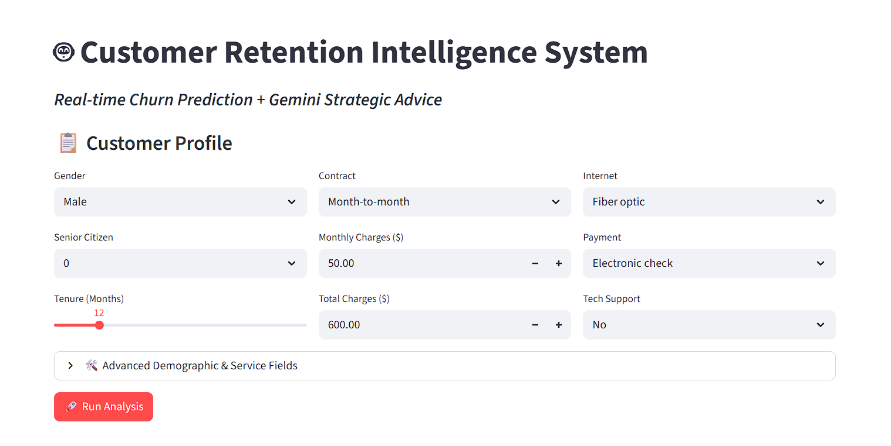
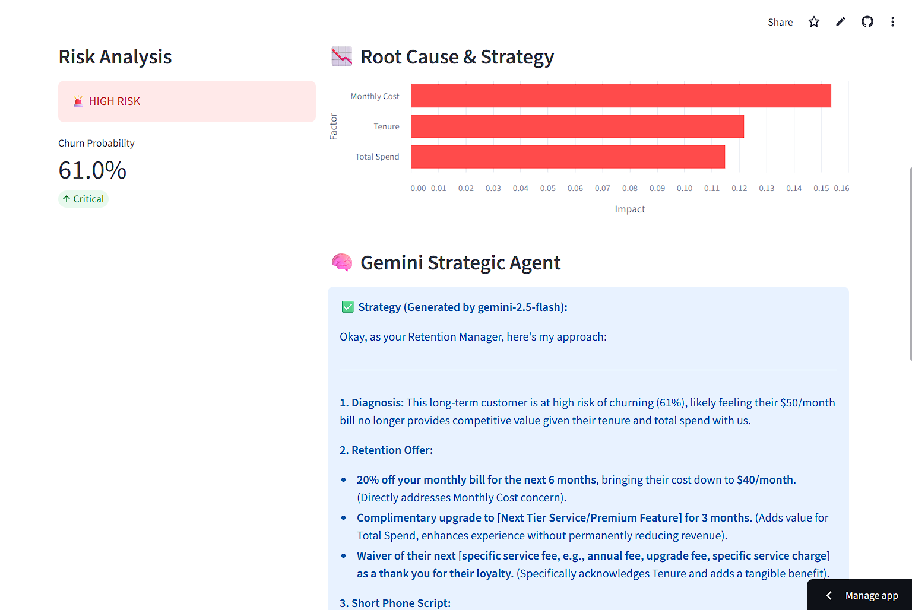

# 🤖 AutoOps AI: Customer Retention Intelligence System

AutoOps AI is an end-to-end Machine Learning application designed to predict customer churn in real-time and generate automated, strategic retention plans using Generative AI (Google Gemini 2.5 flash).

Unlike traditional dashboards that only show data, AutoOps AI solves the "Black Box" problem by explaining **why** a customer is at risk and prescribing **how** to retain them with a personalized support script.


---

## 1. 📸 UI Preview

- **Risk Analysis Dashboard:**
  *Real-time probability scoring and feature importance visualization.*
  

- **AI-Generated Strategy:**
  *Generative AI (Gemini) diagnoses the root cause and writes a specific script for the support agent.*
  

---

## 2. 🚀 Features

- **Real-Time Churn Prediction**
  - Uses a **Random Forest Classifier (v1.6.1)** to calculate churn probability instantly.
  - Supports dynamic "What-If" analysis (e.g., *Does switching to a 2-year contract lower risk?*).
- **Generative AI Strategy Agent**
  - Integrated **Google Gemini 2.5 Flash** model.
  - Automatically diagnoses the root cause of churn and writes a specific script/email for the support agent to use.
- **Explainable AI (XAI)**
  - Visualizes top risk drivers (e.g., Monthly Charges vs. Tech Support) using Altair charts.
- **Smart Math UI**
  - The interface automatically calculates totals and updates risk scores in real-time without requiring a page reload.
- **Hybrid Architecture**
  - **Local Mode:** Microservices architecture (FastAPI Backend + Streamlit Frontend).
  - **Cloud Mode:** Unified application optimized for Streamlit Community Cloud (Zero-Sleep Architecture).
- **Docker Support**
  - Fully containerized environment for reproducible deployment.

---

## 3. 🛠️ Tech Stack

- **Backend:** FastAPI, Uvicorn
- **Frontend:** Streamlit, Altair (Visualization), Pandas
- **Machine Learning:** Scikit-Learn 1.6.1, Joblib
- **Generative AI:** Google Gemini API (`google-generativeai`)
- **DevOps:** Docker, Docker Compose
- **Deployment:** Streamlit Community Cloud

---

## 4. 📊 Data & Methodology

### 4.1 Data Source
The model was trained on the **Telco Customer Churn** dataset (IBM Sample Data), containing **7,043** records.
- **Target:** `Churn` (Yes/No).
- **Preprocessing Pipeline:**
  - **Numerical:** Scaled using `StandardScaler`.
  - **Categorical:** Encoded using `OrdinalEncoder` (handling unknown categories automatically).
  - **Imbalance Handling:** Utilized **Class Weight Balancing** (`class_weight='balanced'`) within the Random Forest algorithm to penalize misclassifying the minority class.

### 4.2 Model Architecture
- **Algorithm:** Random Forest Classifier.
- **Optimization:** Hyperparameter tuning via **GridSearchCV** (5-Fold Cross Validation) optimizing for **F1-Score**.
- **Key Hyperparameters Tuned:** `n_estimators`, `max_depth`, `min_samples_split`.

### 4.3 MLOps & Drift Detection (Research Phase)
*Note: These modules are preserved in the `research_and_training/` folder.*
- **Drift Detection:** Implemented **Kolmogorov-Smirnov (KS) Tests** (`scipy.stats`) to detect statistical deviations in feature distributions between historical and latest data.
- **Automated Retraining:** A decision engine (`decision_engine.py`) that triggers model retraining if drift is detected (p-value < 0.05).

---

## 5. 📂 Project Structure

```text
Auto_Ops_AI-main/
│
├── deploy/                  # Backend API (FastAPI) - The "Brain"
│   └── app.py
│
├── model/                   # The Intelligence (Saved Model)
│   └── model_v1.pkl
│
├── research_and_training/   # The "Factory" (Archives & Research)
│   ├── data/                # Historical Training Data
│   ├── decision_engine.py   # MLOps Logic
│   ├── drift_checker.py     # Stats Logic (KS Test)
│   └── train_model.py       # Training Pipeline
│
├── .env                     # API Keys (GitIgnored)
├── .gitignore               # Security
├── Dockerfile               # Container Config
├── docker-compose.yml       # Service Orchestration
├── app_cloud.py             # Unified App for Cloud Deployment
├── streamlit_app.py         # Frontend for Local Dev
├── requirements.txt         # Dependencies
└── README.md                # Documentation

```

---

## 6. 💻 Running Locally (Standard Python)

This mode is ideal for active development where you want to modify the backend and frontend separately.

### 6.1 Prerequisites
- **Python 3.11+**
- A **Google Gemini API Key** (Get one at [aistudio.google.com](https://aistudio.google.com/))

### 6.2 Setup Environment

**Create a virtual environment (optional but recommended):**
```bash
python -m venv .venv
# Windows:
.venv\Scripts\activate
# macOS / Linux:
source .venv/bin/activate
```
**Install dependencies:**
```bash
pip install -r requirements.txt
```
**Set your Gemini API key:**
Create a `.env` file in the root directory:
```bash
GEMINI_API_KEY="your_actual_api_key_here"
```
### 6.3 Start the Application
You need two terminals open to run the full stack locally.

**Terminal 1: Start the Backend**
```bash
uvicorn deploy.app:app --reload --port 8000
```
**Terminal 2: Start the Frontend**
```bash
streamlit run streamlit_app.py
```
### **Section: Docker Deployment**
### 7. 🐳 Running with Docker
If you prefer a clean, containerized setup without installing Python libraries manually.

### 7.1 Prerequisites
- **Docker Desktop** installed
- **Gemini API Key** in `.env` file

### 7.2 Start the stack
From the repo root:
```bash
docker-compose up --build
```
### 7.3 Stop the stack
```bash
docker-compose down
```
## 8. ☁️ Deployment (Streamlit Cloud)
This project is optimized for **Streamlit Community Cloud** (Free Tier).
**[👉 Click here to view the Live Demo](https://autoopsai-fezxzxx5g5g23y8qy6phuh.streamlit.app/)**

*Note: The cloud deployment uses `app_cloud.py`. This specialized file combines the frontend and model logic into a single script to prevent "sleeping app" errors common on free backends.*

### Steps to Deploy Your Own:
1. **Fork** this repository.
2. Go to [share.streamlit.io](https://share.streamlit.io).
3. Select `app_cloud.py` as the main entry file.
4. Add `GEMINI_API_KEY` to the **Streamlit Secrets** settings (ensure you use double quotes).
## 9. 📝 Development Notes
- **Model Versioning:** The model was trained using `scikit-learn==1.6.1`. Attempting to load it with older versions (e.g., 1.5.x) may cause stability issues.
- **Smart Selector:** The application includes a `get_gemini_response()` function that automatically cycles through available models (`gemini-1.5-flash`, `gemini-pro`, etc.) to ensure the app doesn't crash if Google updates model names.
